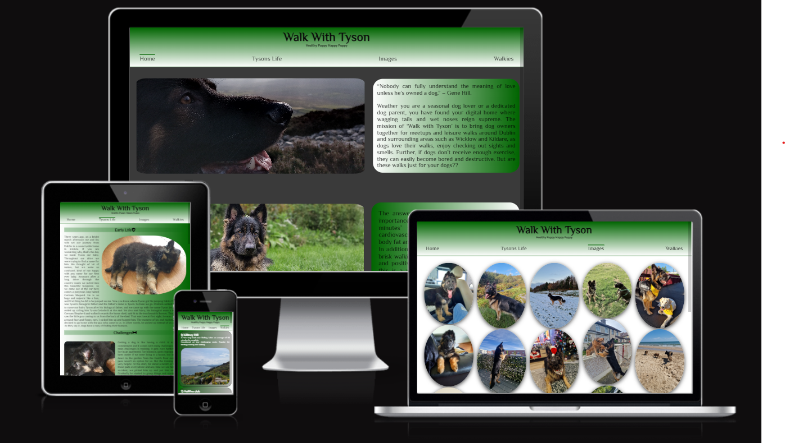

# **_Walk With Tyson_**

## Introduction 

The mission of the website, Walk With Tyson is to enhance the bond between dogs and their owners
through purposeful and enjoyable walks. Tyson is the name of my dog, a three year old German
Shepherd boy, therefore the title Walk With Tyson. This site would enable dog owners to sign up
for different trails in Dublin and Wicklow, where all dog owners can meet up at a point and go on
walks together. This session would help to socialise the dogs better in a more relaxed environment.
This would also give an opportunity for the dog owners to discuss their challenges and doubts in
bringing up a dog with good health and behaviour.

Why not sign up to <a href="https://ivane212.github.io/Walk-With-Tyson/index.html" target="_blank" rel="noopener">Walk With Tyson</a>

# Content

    * [User Experience UX](<#user-experience-ux>)
        * [ Design](<#Design>)
        * [ Structure](<#site-structure>)

# User Experience - UX

## As a web designer, my aim is to:

    * Create a website that is user friendly and looks interesting.
    * Make the navigation simple for the users.
    * To give an idea to users (dog owners) about Tyson so that they can decide if he is compatible with their dogs. 
    * To make users understand the purpose of the page and walks
    * To make it easy for the users to find out all the trails and details.
    * To enable signing- up for the walks without any technical difficulty. 

# Design

## Website Framework

Walk With Tyson Website consists four pages: [Home](index.html) is the main laoding page, [Tysons Life](tysons-life.html), [Images](images.html), and [Walkies](Walkies.html). All pages are all accessible from navigation bar. The header is clickable and will return the user to home page if used. Links to social media are placed at the footer of every page.

[Back to top](<#content>)
## Interactive Links

Users can access the link for social media at the bottom of all four pages by clicking the icons for Facebook, X(Twitter), YouTube and Instagram. by clicking the icons users will leave the website and a new tab will be opened.
    
## Font

Philosopher, sans-serif is the font used for all the pages throught the website. 

## Colour Scheme

There are 14 colours used throughout the Project. Green is used as the predominant colour as the website is about nature and walks. 

## Media 

All the photos and videos used are original as they are of my dog.

[Back to top](<#content>)
# Features

Home page is the initial web page the user will view when they click the link to this website. The page consists of the following sections:

## Header

The title of the website is Walk With Tyson and the slogan is Healthy Puppy Happy Puppy. The text is in dark green colour on light green background as green depicts nature and the aim of the page is to organise scenic walks for dogs.  The title of the website rotates when the cursor hovers over.

## Navigation Menu

A fully responsive Navigation Menu is available for users on top of all the four pages of this website.
