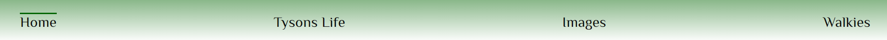
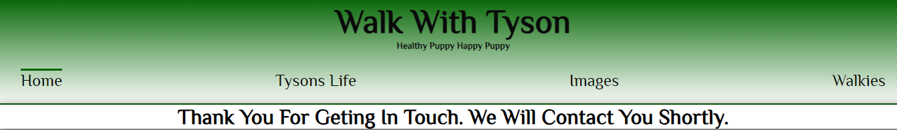

# **_Walk With Tyson_**

## Introduction 

The mission of the website, Walk With Tyson is to enhance the bond between dogs and their owners
through purposeful and enjoyable walks. Tyson is the name of my dog, a three year old German
Shepherd boy, therefore the title Walk With Tyson. This site would enable dog owners to sign up
for different trails in Dublin and Wicklow, where all dog owners can meet up at a point and go on
walks together. This session would help to socialise the dogs better in a more relaxed environment.
This would also give an opportunity for the dog owners to discuss their challenges and doubts in
bringing up a dog with good health and behaviour.

Why not sign up to <a href="https://ivane212.github.io/Walk-With-Tyson/index.html" target="_blank" rel="noopener"> Walk With Tyson </a>

# Content

* [**Introduction**](<#introduction>)
* [**User Experience UX**](<#user experience UX>)
* [**Design**](<#design>)

    * [**Website Structure**](<#website structure>)
    * [**Interactive Links**](<#interactive links>)
    * [**Font**](<#font>)
    * [**Colour Scheme**](<#colour scheme>)
    * [**Media**](<#media>)

* [**Features**](<#features>)
    *  [**Header**](<#header>)
    *  [**Navigation Menu**](<#navigation menu>)
    *  [**Menu**](<#menu>)
    *  [**Footer**](<#footer>)
    *  [**Page 2 Tyson's Life**](<#page 2 tyson's life >)
    *  [**Page 3 Images**](<#page 3 images >)
    *  [**Page 4 Walkies**](<#page 4 walkies >)

*  [**Technologies Used**](<#technologies used>)
    *  [**Git**](<#git>)
    *  [**GitHub**](<#github>)

*  [**Sources**](<#sources>)

*  [**Testing**](<#testing>)
    * [**Browsers Used**](<#browsers used>)
    * [**Devices used**](<#devices used>)

* [**Credits**](<#credits>)

* [**Acknowledgement**](<#acknowledgement>)

* [**Note**](<#note>)

   

# User Experience - UX

## As a web designer, my aim is to:

* Create a website that is user friendly and looks interesting.
* Make the navigation simple for the users.
* To give an idea to users (dog owners) about Tyson so that they can decide if he is compatible with their dogs. 
* To make users understand the purpose of the page and walks
* To make it easy for the users to find out all the trails and details.
* To enable signing- up for the walks without any technical difficulty. 

# Design

## Website Structure

Walk With Tyson consists of four pages: [Home](index.html) is the main laoding page, [Tysons Life](tysons-life.html), [Images](images.html), [Walkies](Walkies.html) and a Thank You message that pops up when a user sign up for walks. All the four pages are all accessible from navigation bar except for the secret Thank You page. The header is responsive and will return the user to home page when used. Links to social media are placed at the footer of every page.

[Back to top](<#content>)
## Interactive Links

Users can access the link to social media at the bottom of all four pages by clicking the icons for Facebook, X(Twitter), YouTube and Instagram. By clicking the icons users will leave the website and a new tab will be opened.
    
## Font

Philosopher, sans-serif is the font used for all the pages throught the website. 

## Colour Scheme

There are 14 colours used throughout the Project. Green is used as the predominant colour as the website is about nature and walks. 

## Media 

All the photos and videos used are original as they are of my dog.

[Back to top](<#content>)
# Features

## Main Page
Home page is the initial web page the user will view when they click the link to this website. The page consists of the following sections:

## Header

The title of the website is Walk With Tyson and the slogan is Healthy Puppy Happy Puppy. The text is in black colour on light green-white background as green depicts nature and the aim of the page is to organise scenic walks for dogs.  The title of the website rotates when the cursor hovers over.

## Navigation Menu

A fully responsive Navigation Menu is available for users on top of all the four pages of this website. When cursor hovers over each navigation button, text and background colours transition occurs. 

## Main 

The main page consists of two photos of Tyson (German Shepherd dog) and text content.  The first photo is placed below the navigation menu on the left hand side of the page while the right hand side consists of a quote and a paragraph explaining the aim of the website which is bringing dogs and their owners together for walks. Underneath that, there is another photo of the dog on the left and a second paragrapgh on the right that continues to explain about the website. However on a mobile screen the first photo is displayed below navigation bar followed by the first paragrapgh. Below that, is the second photo followed by second paragraph.

## Footer

The footer consists of four social media icons placed in a row. When a user clicks on one of the icons, it will navigate them to the respective social media pages. The footer remains persistent on all the four pages of the website.

## Page 2: Tyson's Life

This page has eight photos and two videos. The aim of this page is to describe about Tyson as well as to discuss about the mental and physical health benefits to dogs, through regular meet ups and walks. This page also discusses about the benefits for owners by participating in these walks. The content of this page is sub-divided into five sections called Early Life, Challenges, Happy Times, Behaviours and Health.

## Page 3: Images

Images page contains 18 photos of Tyson (German Shepherd dog). Photos are placed in chronological order so that the viewer can see the growth phases of Tyson from a pup to an adult dog. The users can also see photos of Tyson socializing with other breeeds including small, medium and large sized dogs.

## Page 4: Walkies

On this page six trails are listed along with their photos and a sign-up form.  Viewers can read information about the trails and sign up for the trail they are interested in. Sign up form needs details of both dogs and their owners. The confirmation button named 'Let's Go' rotates when the cursor hovers over. 

## Thank You Page

Once the user has signed up for a walk a Thank You page will be displayed. This page is hidden and only pops up after the user completes sign up. Header, navigarton bar and footer remain the same on this page like the other four pages.

[Back to top](<#content>)
# Technologies Used

* [HTML](https://en.wikipedia.org/wiki/HTML) : Used as the standard markup language for creating the project. 
* [CSS](https://en.wikipedia.org/wiki/CSS): Used to style and layout HTML elements on the website.
* [VSCode](https://code.visualstudio.com/): Used to create the codes
* [Google Fonts](https://fonts.google.com/): Used to import font for the project.
* [Font Awesome](https://fontawesome.com/): Used to import different icons for the project.
* [Favicon](https://favicon.io/): Used to create and impoert personal favicon for the webiste. 
* [Optimizilla](https://imagecompressor.com/): Used to optimize photos. 
* [Image Resizer](https://imageresizer.com/): Used to resize photos.
    
### Git

Used as a version control system to track my progress, any changes made and to push files to GitHub.

### GitHub

Used to create Git repositories for the project and review any changes made. It is also used for storage of project.

## Sources

**Sources for content**: Information provided about my dog Tyson is original derived from my own knowledge. Some health and behavioural facts about dogs in general as well as information about trails are derived from the following:
 * https://pupford.com/why-dogs-jump
 * https://www.thekennelclub.org.uk/health-and-dog-care
 * https://www.masterclass.com/articles/dog-neutering
 * https://www.alltrails.com

 **Sources for technical support**: 
 * https://imageresizer.com
 * https://coolors.co
 * https://fontawesome.com
 * https://ui.dev/amiresponsive

 **Sources for media**: All the photos and videos used are original.

 [Back to top](<#content>)

# Deployment

The website was deployed from Github using the following steps:
* Open 'GitHub'.
* Click on project to be deployed.
* Click on 'Settings'.
* Navigate to 'GitHub Pages'.
* Select 'Check it out here'.
* Click on 'Main' and click 'Save'.
* Link to live website displays on top.

[Back to top](<#content>)

# Testing

All the four pages of this project were validated using W3C Markup Validator and W3C CSS Validator and the rsults can be seen below: 
* W3C Markup Validator: [Result here](https://validator.w3.org/nu/?doc=https%3A%2F%2Fivane212.github.io%2FWalk-With-Tyson%2F)

## Browsers Used
* Google Chrome
* Microsoft Edge
* Mozilla Firefox
* Opera

## Devices Used
* Huawei MateBook D15
  * Google Chrome Version 120.0.6099.218
  * Microsoft Edge Version 120.0.2210.144 
  * Opera Version:120.0.6099.217 
  * Mozilla Firefox Version 121.0.1 (64-bit)
* Lenovo 81 MT
  * Google Chrome Version 120.0.6099.218
  * Microsoft Edge Version 120.0.2210.133
* Hannspree HL247
  * Google Chrome Version 120.0.6099.201
  * Microsoft Edge Version 119.0.2151.97
* Samsung Galaxy S22 Ultra
  * Google Chrome Version 120.0.6099.230

  [Back to top](<#content>)

# Credits

* Social media icons and part of sign up form inspired by Love Running Project.
* Readme.md inspired by Wawas Woods project.
* YouTube tutorial videos for project ideas and troubleshooting.
* Content information taken from following websites: [Pupford](https://pupford.com/why-dogs-jump/), [The Kennel Club](https://www.thekennelclub.org.uk/health-and-dog-care), [MasterClass Articles](https://www.masterclass.com/articles/dog-neutering) and [Alltrails](https://www.alltrails.com/).

# Acknowledgement

* Special thanks to tutor Paul Thomas and mentor Precious Ijege for their time and support throughtout the project.
* Ayana Gelashvili for photography and motivation.
* Members of Stack community.

# Note

This section has been added as advised by my tutor.   At the start of my project I encountered numerous challenges, leading to prolonged troubleshooting at different phases of the project. Various adjustments to the code were made by referring tutorials. Initially, I committed every modification made during the project. However I deviated from this practice by mistake, and forgot to commit updates at certain points. When I realised it, I employed a simple commit message, namely "push" to save my work on Github. I thought of creating a new GitHub repository and transfer my entire work from the initial project. However, my tutor advised me not to do so, to avoid the impression of expeditiously completing a huge amount work in an unrealistic timeframe. Therefore, I kept working within the existing GitHub repository. Hope this helps to clear any confusion that may have caused while checking my work. Please note I have no previous experience in coding and this is my first time learning it. I will try my level best to avoid these mistakes in the future. 

